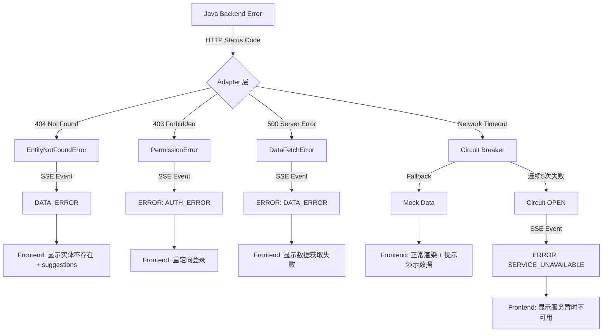

# 架构优化方案

> Insight AI Agent 三方协调架构优化设计 (Phase 6+ 前端集成准备)

**文档版本**: v1.0
**创建日期**: 2026-02-04
**目标读者**: 系统架构师、前端团队、Java 后端团队、Python 后端团队

---

## 执行摘要

### 当前状态 (Phase 7 完成)

✅ **已完成**:
- Python FastAPI 后端: 完整的 AI Agent 流水线 (Router → Planner → Executor)
- Java 后端对接: Adapter 层 + httpx 客户端 (重试 + 熔断 + 降级)
- SSE 流式协议: BLOCK_START/SLOT_DELTA/BLOCK_COMPLETE 逐 block 事件
- Patch 机制: 增量修改避免全页重建
- RAG 知识库: 题目生成已接入课纲/Rubric/知识点

🔲 **待完成**:
- 前端集成 (Next.js proxy + SSE 消费)
- 三方 API 版本管理和变更协调机制
- 统一的监控和性能指标

### 核心问题

1. **三方协调职责模糊**: Java ↔ Python ↔ 前端，缺乏清晰契约
2. **数据流向不明确**: 多次格式转换 (Java DTO → Internal Model → TypeScript)
3. **错误处理链路不完整**: Java 错误 → Python → SSE → 前端，缺乏统一规范
4. **Phase 8 升级路径不清晰**: 如何平滑过渡到通用知识层？

### 优化目标

1. **明确三层职责边界**: 前端层 / AI 编排层 / 数据服务层
2. **统一数据契约**: 减少转换层次，自动生成 TypeScript 类型
3. **完善错误处理链路**: Java → Python → SSE → 前端，全链路错误码映射
4. **建立性能 SLA**: 响应时间、并发、缓存策略
5. **规划 Phase 8 升级**: 通用知识层架构平滑过渡

---

## 架构优化方案

### 方案 1: 三层职责清晰化

#### 1.1 架构全景

```
┌─────────────────────────────────────────────────────────────────────┐
│                         前端层 (Next.js)                              │
│  职责: UI 渲染 + 用户交互 + SSE 消费 + 客户端状态管理                 │
├─────────────────────────────────────────────────────────────────────┤
│  核心能力:                                                            │
│  - API Routes Proxy: /api/ai/* → Python FastAPI                     │
│  - SSE EventSource: 实时消费 Python SSE 流                           │
│  - State Management: Blueprint/Page/Context 缓存                    │
│  - Component Rendering: 6 种 Block 类型渲染                          │
│  - Error Boundary: 统一错误处理和用户提示                             │
├─────────────────────────────────────────────────────────────────────┤
│  禁止直接调用:                                                        │
│  ❌ Java 后端 API (必须通过 Python 编排层)                            │
│  ❌ 直接操作 LLM API (必须通过 Python Agent)                         │
└─────────────────────────────────────────────────────────────────────┘
                            │ HTTP/SSE
                            ▼
┌─────────────────────────────────────────────────────────────────────┐
│                    AI 编排层 (Python FastAPI)                         │
│  职责: 意图理解 + Blueprint 生成 + 页面编排 + RAG 检索               │
├─────────────────────────────────────────────────────────────────────┤
│  核心 Agents:                                                        │
│  - RouterAgent: 意图分类 (chat/build/clarify/refine/rebuild)         │
│  - EntityResolver: 班级/学生/作业实体解析                            │
│  - PlannerAgent: user prompt → Blueprint (结构化执行计划)            │
│  - ExecutorAgent: Blueprint → Page (三阶段流式执行)                  │
│  - PatchAgent: 增量修改分析 (layout/compose/rebuild)                 │
│  - QuestionPipeline: Draft→Judge→Repair 题目生成流水线               │
│                                                                       │
│  工具层 (FastMCP):                                                   │
│  - DataTools: get_teacher_classes / get_class_detail / ...          │
│  - StatsTools: calculate_stats / compare_performance                │
│  - AssessmentTools: analyze_student_weakness                         │
│  - RubricTools: get_rubric                                          │
│  - RAG: retrieve_curriculum / retrieve_knowledge_points (Phase 7)   │
│                                                                       │
│  Adapter 层:                                                         │
│  - class_adapter / submission_adapter / grade_adapter               │
│  - Java DTO → Internal Data Model 转换                              │
├─────────────────────────────────────────────────────────────────────┤
│  对上接口: 统一会话网关 POST /api/conversation                        │
│  对下接口: Java RESTful API (via httpx + retry + circuit breaker)   │
├─────────────────────────────────────────────────────────────────────┤
│  禁止直接操作:                                                        │
│  ❌ 数据库直接读写 (必须通过 Java 后端)                               │
│  ❌ 前端 UI 逻辑 (只负责数据和 AI 编排)                               │
└─────────────────────────────────────────────────────────────────────┘
                            │ HTTP + Bearer Token
                            ▼
┌─────────────────────────────────────────────────────────────────────┐
│                    数据服务层 (Java SpringBoot)                       │
│  职责: 教务数据 CRUD + 权限控制 + 业务规则                            │
├─────────────────────────────────────────────────────────────────────┤
│  核心职责:                                                            │
│  - 数据持久化: 班级/学生/作业/成绩 CRUD                               │
│  - 权限验证: 教师只能访问自己的班级数据                               │
│  - 业务规则: 作业提交截止时间、成绩计算规则                           │
│  - 数据校验: 输入参数合法性校验                                       │
│                                                                       │
│  提供 RESTful API:                                                   │
│  - GET /dify/teacher/{id}/classes/me                                │
│  - GET /dify/teacher/{id}/classes/{classId}                         │
│  - GET /dify/teacher/{id}/classes/{classId}/assignments             │
│  - GET /dify/teacher/{id}/submissions/assignments/{assignmentId}    │
│  - GET /dify/teacher/{id}/submissions/students/{studentId}          │
├─────────────────────────────────────────────────────────────────────┤
│  禁止直接暴露:                                                        │
│  ❌ 直接暴露给前端 (必须通过 Python 编排层)                           │
│  ❌ 包含 AI 逻辑 (只负责数据和业务规则)                               │
└─────────────────────────────────────────────────────────────────────┘
```

#### 1.2 职责矩阵

| 职责 | 前端 Next.js | Python FastAPI | Java SpringBoot |
|------|-------------|---------------|----------------|
| **UI 渲染** | ✅ 主责 | ❌ | ❌ |
| **用户交互** | ✅ 主责 | ❌ | ❌ |
| **SSE 消费** | ✅ 主责 | ❌ | ❌ |
| **状态管理** | ✅ 主责 (客户端) | 🟡 辅助 (服务端缓存) | ❌ |
| **意图理解** | ❌ | ✅ 主责 (RouterAgent) | ❌ |
| **Blueprint 生成** | ❌ | ✅ 主责 (PlannerAgent) | ❌ |
| **页面编排** | ❌ | ✅ 主责 (ExecutorAgent) | ❌ |
| **实体解析** | ❌ | ✅ 主责 (EntityResolver) | ❌ |
| **RAG 检索** | ❌ | ✅ 主责 (RAG Service) | ❌ |
| **LLM 调用** | ❌ | ✅ 主责 (PydanticAI) | ❌ |
| **数据获取** | ❌ | 🟡 转发 (via Adapter) | ✅ 主责 |
| **数据持久化** | ❌ | ❌ | ✅ 主责 |
| **权限验证** | ❌ | 🟡 辅助 (传递 teacherId) | ✅ 主责 |
| **业务规则** | ❌ | ❌ | ✅ 主责 |

---

### 方案 2: 数据契约统一化

#### 2.1 数据流转层次

```
┌──────────────────┐
│  Java Backend    │
│  (snake_case /   │
│   camelCase 混合) │
└────────┬─────────┘
         │ HTTP Response: Result<T>
         ▼
┌──────────────────┐
│  Adapter 层       │ ← Phase 5 引入，隔离 Java DTO 变化
│  (Python)        │
└────────┬─────────┘
         │ Internal Data Model (ClassInfo, GradeData, ...)
         ▼
┌──────────────────┐
│  Tools 层         │
│  (FastMCP)       │
└────────┬─────────┘
         │ Tool Output (dict)
         ▼
┌──────────────────┐
│  ExecutorAgent   │
│  (Phase C)       │
└────────┬─────────┘
         │ SSE Events (BlockStartEvent, SlotDeltaEvent, ...)
         ▼
┌──────────────────┐
│  CamelModel      │ ← Phase 1 引入，自动 snake_case → camelCase
│  (Pydantic)      │
└────────┬─────────┘
         │ JSON Response (camelCase)
         ▼
┌──────────────────┐
│  Frontend        │
│  (TypeScript)    │
└──────────────────┘
```

#### 2.2 关键数据模型映射

| Java DTO | Internal Model (Python) | Frontend TypeScript |
|----------|------------------------|---------------------|
| `ClassroomDTO` | `ClassInfo(CamelModel)` | `interface ClassInfo` |
| `SubmissionDTO` | `SubmissionRecord(CamelModel)` | `interface SubmissionRecord` |
| `GradeHistoryItem` | `GradeRecord(CamelModel)` | `interface GradeRecord` |
| `Result<List<ClassroomDTO>>` | `list[ClassInfo]` | `ClassInfo[]` |

**命名规范**:
- Java DTO: `snake_case` 或 `camelCase` (遗留混合)
- Internal Model: `snake_case` (Python 标准)
- Frontend JSON: `camelCase` (自动由 CamelModel 序列化)
- Frontend TypeScript: `camelCase` (interface 定义)

#### 2.3 自动生成 TypeScript 类型 (建议 Phase 6+)

**方案**: 使用 `pydantic-to-typescript` 自动生成

```bash
# 安装工具
pip install pydantic-to-typescript

# 生成类型定义
pydantic2ts --module models.blueprint --output frontend/types/blueprint.ts
pydantic2ts --module models.conversation --output frontend/types/conversation.ts
pydantic2ts --module models.data --output frontend/types/data.ts
```

**优势**:
- ✅ 消除手写 TypeScript 类型的维护成本
- ✅ 确保 Python ↔ TypeScript 类型一致性
- ✅ Python 模型变更后自动同步

---

### 方案 3: 统一错误处理链路

#### 3.1 错误流转图



#### 3.2 错误码映射表

| 场景 | Java 错误 | Python 异常 | SSE 事件 | 前端处理 |
|------|-----------|-------------|----------|----------|
| **实体不存在** | 404 Not Found | `EntityNotFoundError` | `DATA_ERROR` | 显示 "班级/学生不存在" + suggestions |
| **权限不足** | 403 Forbidden | `PermissionError` | `ERROR` (code: `AUTH_ERROR`) | 重定向登录或显示无权限提示 |
| **服务器错误** | 500 Internal Error | `DataFetchError` | `ERROR` (code: `DATA_ERROR`) | 显示 "数据获取失败，请稍后重试" |
| **网络超时** | Timeout | `httpx.TimeoutError` → Circuit Breaker | (无错误，降级 mock) | 正常渲染 + 提示 "当前使用演示数据" |
| **熔断器打开** | 连续 5 次失败 | `CircuitOpenError` | `ERROR` (code: `SERVICE_UNAVAILABLE`) | 显示 "服务暂时不可用，已自动切换演示模式" |
| **参数校验失败** | 400 Bad Request | `ValidationError` | `ERROR` (code: `VALIDATION_ERROR`) | 显示具体字段错误信息 |
| **LLM 调用失败** | N/A | `LLMError` | `ERROR` (code: `AI_ERROR`) | 显示 "AI 服务暂时不可用" |
| **Blueprint 解析失败** | N/A | `BlueprintValidationError` | `ERROR` (code: `BLUEPRINT_ERROR`) | 显示 "任务规划失败，请重新描述" |

#### 3.3 SSE 错误事件格式

**标准 ERROR 事件**:
```json
{
  "type": "ERROR",
  "code": "DATA_ERROR | AUTH_ERROR | SERVICE_UNAVAILABLE | ...",
  "message": "用户友好的错误描述",
  "details": {
    "path": "/dify/teacher/t-001/classes/class-2c",
    "statusCode": 404,
    "timestamp": "2026-02-04T10:00:00Z"
  }
}
```

**DATA_ERROR 事件** (Phase 4.5 引入):
```json
{
  "type": "DATA_ERROR",
  "entity": "class-2c",
  "entityType": "class",
  "message": "班级 2C 不存在",
  "suggestions": [
    {"label": "1A 班", "value": "class-1a"},
    {"label": "1B 班", "value": "class-1b"}
  ]
}
```

---

### 方案 4: 性能 SLA 和监控

#### 4.1 响应时间 SLA

| 端点 | P50 | P90 | P99 | 超时阈值 |
|------|-----|-----|-----|---------|
| `POST /api/conversation` (chat) | < 500ms | < 1s | < 2s | 5s |
| `POST /api/conversation` (build) | < 2s | < 5s | < 10s | 30s |
| `POST /api/page/generate` (SSE) | TTFB < 1s | 完整流 < 30s | 完整流 < 60s | 120s |
| `POST /api/page/patch` (layout) | < 200ms | < 500ms | < 1s | 2s |
| `POST /api/page/patch` (compose) | < 2s | < 5s | < 10s | 30s |
| Java API 调用 | < 100ms | < 300ms | < 500ms | 15s (可配置) |

**说明**:
- **TTFB** (Time To First Byte): SSE 第一个事件到达时间
- **P50/P90/P99**: 中位数/90分位/99分位响应时间
- **超时阈值**: 触发 timeout 错误的时间

#### 4.2 缓存策略

| 数据类型 | 缓存位置 | 缓存时长 | 失效策略 |
|---------|---------|---------|---------|
| **Blueprint** | 前端 State | 会话期间 | 用户刷新页面 / rebuild |
| **Page** | 前端 State | 会话期间 | 用户刷新页面 / refine / rebuild |
| **Data Context** | 前端 State | 会话期间 | 用户重新选择数据 |
| **Compute Results** | 前端 State | 会话期间 | 数据变更 |
| **Teacher Classes** | Python Memory | 5 分钟 | TTL 过期 / 手动清除 |
| **RAG 检索结果** | Python Memory | 30 分钟 | TTL 过期 |
| **Rubric / 知识点** | Python Memory | 永久 (启动时加载) | 应用重启 |

**设计原则**:
- ✅ **前端优先缓存**: Blueprint/Page/Context 在前端缓存，减少 SSE 重建
- ✅ **Python 辅助缓存**: 高频数据 (Teacher Classes) 短时缓存
- ✅ **Java 无缓存**: Java 后端只负责数据持久化，不做缓存

#### 4.3 并发控制

| 场景 | 限制策略 | 说明 |
|------|---------|------|
| **单用户并发请求** | 同一 teacherId 最多 3 个并发 SSE 流 | 防止恶意并发 |
| **LLM 并发调用** | 每个 ExecutorAgent 最多 5 个并发 block 生成 | 避免 LLM API 限流 |
| **Java API 并发** | 连接池 50 连接 (可配置) | httpx.AsyncClient 连接池管理 |

---

### 方案 5: Phase 8 升级路径规划

#### 5.1 升级目标

将 RAG 从 "QuestionPipeline 专用" 升级为 "通用 Knowledge Layer"，支持批改、备课等场景。

#### 5.2 架构变更

**当前架构 (Phase 7)**:
```
PlannerAgent → Blueprint (DataContract only)
                   ↓
ExecutorAgent Phase A: Data Binding (调用 data_tools)
                   ↓
ExecutorAgent Phase C: Compose (AI 生成，无知识约束)

QuestionPipeline 专用 RAG (硬编码调用)
```

**目标架构 (Phase 8)**:
```
PlannerAgent → Blueprint (DataContract + KnowledgeContract)
                   ↓
ExecutorAgent Phase A: Input Binding (Data + Knowledge 混合拓扑排序)
  ├─ DataBinding: 调用 data_tools (现有)
  └─ KnowledgeBinding: 调用 knowledge_tools (新增)
                   ↓
ExecutorAgent Phase C: Compose (注入 data_context + knowledge_context)
  ├─ template_tools 约束输出格式
  └─ 使用混合上下文构建 prompt

通用 QualityPipeline 基类
  ├─ QuestionQualityPipeline (出题)
  ├─ GradingQualityPipeline (批改)
  └─ LessonQualityPipeline (备课)
```

#### 5.3 平滑升级步骤

**阶段 1: 模型扩展** (不破坏现有功能)
- [x] Phase 7: `models/rubric.py` + `models/question_pipeline.py` (已完成)
- [ ] Phase 8.1: `models/blueprint.py` 新增 `KnowledgeBinding` 类
- [ ] Phase 8.1: `DataContract` 新增 `knowledge_bindings: list[KnowledgeBinding]`

**阶段 2: 工具层扩展** (向后兼容)
- [ ] Phase 8.2: `tools/knowledge_tools.py` 新增 4 个 RAG 检索工具
- [ ] Phase 8.2: `tools/template_tools.py` 新增 3 个模板工具
- [ ] Phase 8.2: 现有 `data_tools.py` 保持不变

**阶段 3: Executor 渐进式升级** (Feature Flag 控制)
- [ ] Phase 8.3: Executor Phase A 新增 `_resolve_knowledge_bindings()` (与 `_resolve_data_bindings()` 并行)
- [ ] Phase 8.3: Feature Flag `ENABLE_KNOWLEDGE_BINDING` 控制是否执行 Knowledge Binding
- [ ] Phase 8.3: Phase C Compose 注入 `knowledge_context` (向后兼容，无 knowledge 时为空 dict)

**阶段 4: PlannerAgent 渐进式升级** (按场景分流)
- [ ] Phase 8.4: Planner System Prompt 注入 `knowledge_tools` 描述
- [ ] Phase 8.4: Planner 按 task_type 决定是否生成 `knowledge_bindings`:
  - `task_type == "question_generation"` → 生成 knowledge_bindings (检索题库、知识点)
  - `task_type == "grading"` → 生成 knowledge_bindings (检索 rubric anchors、校内规范)
  - `task_type == "lesson_planning"` → 生成 knowledge_bindings (检索教案框架、教材)
  - `task_type == "data_analysis"` → 不生成 knowledge_bindings (现有路径)

**阶段 5: 全量验证** (E2E 测试)
- [ ] Phase 8.5: 批改场景 E2E 测试 (含 knowledge_bindings)
- [ ] Phase 8.5: 备课场景 E2E 测试 (含 knowledge_bindings)
- [ ] Phase 8.5: 数据分析场景回归测试 (无 knowledge_bindings，确保不受影响)

**回滚策略**:
- Feature Flag `ENABLE_KNOWLEDGE_BINDING=false` 完全禁用 Phase 8 功能
- Planner 即使生成了 `knowledge_bindings`，Executor 也会跳过 (Feature Flag 控制)
- 前端无需任何变更 (Blueprint 对前端不透明)

---

## 实施优先级

### 高优先级 (Phase 6 必须)

| 任务 | 负责方 | 预计工作量 |
|------|--------|-----------|
| **前端 Next.js Proxy 实现** | 前端团队 | 3-5 天 |
| **前端 SSE 消费实现** | 前端团队 | 5-7 天 |
| **前端 6 种 Block 组件渲染** | 前端团队 | 7-10 天 |
| **前端错误处理 (ERROR/DATA_ERROR)** | 前端团队 | 2-3 天 |
| **TypeScript 类型定义** | 前端团队 (手写) / Python 团队 (自动生成) | 3-5 天 |
| **Python 性能监控埋点** | Python 团队 | 2-3 天 |
| **Java API 响应时间优化** | Java 团队 | 3-5 天 (如有需要) |

### 中优先级 (Phase 6+)

| 任务 | 负责方 | 预计工作量 |
|------|--------|-----------|
| **自动生成 TypeScript 类型** | Python 团队 + 前端团队 | 2-3 天 (集成 CI/CD) |
| **API 版本管理机制** | 三方协商 | 3-5 天 (设计 + 实施) |
| **前端缓存策略实现** | 前端团队 | 2-3 天 |
| **Python 缓存层实现** | Python 团队 | 2-3 天 (Redis 或内存缓存) |
| **监控 Dashboard** | DevOps 团队 | 5-7 天 (Grafana + Prometheus) |

### 低优先级 (Phase 8)

| 任务 | 负责方 | 预计工作量 |
|------|--------|-----------|
| **Phase 8 架构升级** | Python 团队 | 见 [Phase 8 实施路线图](../roadmap.md#phase-8) |
| **通用知识层 E2E 测试** | Python 团队 | 5-7 天 |

---

## 附录

### A. 关键决策记录

| 决策 | 理由 | 替代方案 |
|------|------|---------|
| **前端禁止直调 Java API** | 避免前端直接依赖 Java 后端变化，统一由 Python 编排层处理实体解析、权限、错误 | 前端直调 Java + Python 只做 AI 编排 (增加前端复杂度) |
| **Adapter 层隔离 Java DTO** | Java API 格式变化时只需修改 Adapter，不影响 Tools/Agents/Frontend | 直接暴露 Java DTO 到工具层 (耦合度高) |
| **CamelModel 自动序列化** | 统一 Python (snake_case) 和 Frontend (camelCase) 命名风格 | 手动转换每个字段 (维护成本高) |
| **SSE 逐 block 流式输出** | 前端可实时渲染，提升用户体验 (打字机效果) | 一次性返回完整页面 (用户等待时间长) |
| **Patch 机制分流** | 微调时避免全页重建，减少 LLM 调用成本和等待时间 | 每次 refine 都完整重建 (成本高) |
| **Phase 8 Feature Flag 渐进式升级** | 降低升级风险，可快速回滚 | 一次性全量升级 (风险高) |

### B. 参考文档

- [后端流程图](backend-flow.md)
- [架构总览](overview.md)
- [前端集成规范](../integration/frontend-integration.md)
- [Java 后端对接](../integration/java-backend.md)
- [SSE 协议](../api/sse-protocol.md)
- [实施路线图](../roadmap.md)

---

**文档维护者**: Python 后端团队
**最后更新**: 2026-02-04
**变更历史**:
- 2026-02-04: 初版发布 (基于 Phase 7 完成状态)
