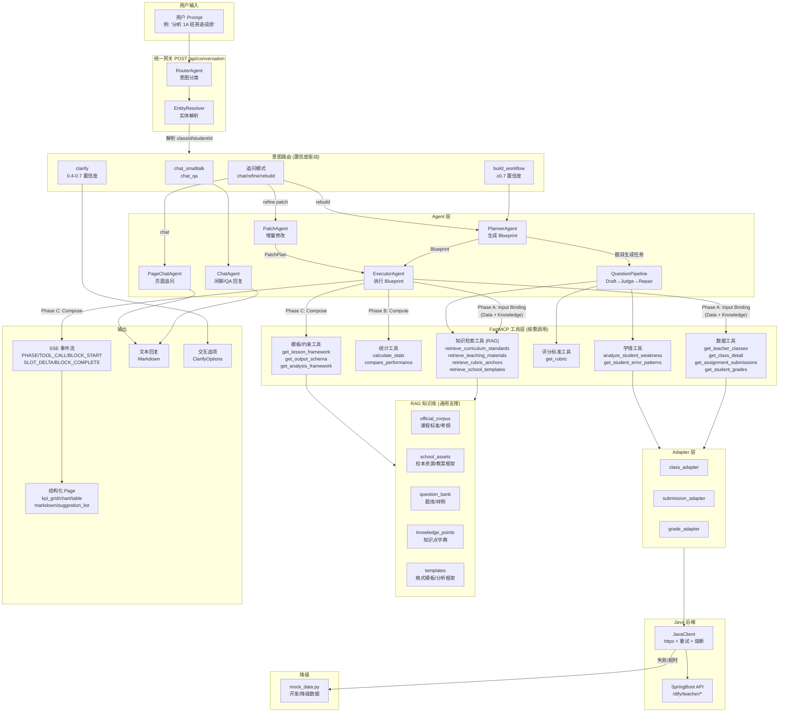
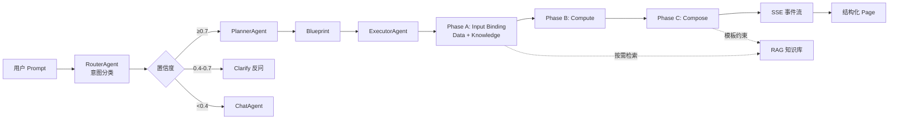

# 后端流程图

> 从用户 Prompt 输入到结构化输出的完整数据流。

---

## 完整流程图



---

## 核心流程说明

### 1. 入口统一

所有请求进入 `POST /api/conversation`，由 **RouterAgent** 进行意图分类：

| 置信度 | 路由行为 |
|--------|---------|
| `≥ 0.7` | 直接执行 `build_workflow` |
| `0.4 ~ 0.7` | 走 `clarify`，返回交互式反问 |
| `< 0.4` | 当 `chat` 处理 |

### 2. 意图分类体系

**初始模式** (无 blueprint 上下文):

| 意图 | 触发条件 | 示例 |
|------|---------|------|
| `chat_smalltalk` | 闲聊/寒暄 | "你好"、"谢谢" |
| `chat_qa` | 问答/咨询 | "怎么用这个功能" |
| `build_workflow` | 明确要生成分析/报告 | "分析 1A 班英语成绩" |
| `clarify` | 缺关键参数 | "分析英语表现"（没说哪个班） |

**追问模式** (有 blueprint/pageContext 上下文):

| 意图 | 触发条件 | 示例 |
|------|---------|------|
| `chat` | 针对已有页面提问 | "哪些学生需要关注？" |
| `refine` | 微调当前页面 | "把图表颜色换成蓝色" |
| `rebuild` | 结构性重建 | "加一个语法分析板块" |

### 3. RAG 知识库 — 通用支撑（按需调取）

RAG 知识库**不是每次都调用**，按"缺口"（数据库无法确定性得到的信息）触发：

| 场景 | 缺口 | 调取的 RAG 库/工具 | 触发条件 |
|------|------|-------------------|----------|
| **题目生成** | 题库、知识点、考纲 | `question_bank` + `knowledge_points` + `official_corpus` | PlannerAgent 识别到"出题"意图 |
| **批改** | 评分样例、校内反馈规范 | `retrieve_rubric_anchors` + `retrieve_school_templates` | PlannerAgent 识别到"批改"意图 + KnowledgeBinding |
| **备课** | 教案框架、教材资源、课程标准 | `get_lesson_framework` + `retrieve_teaching_materials` + `retrieve_curriculum_standards` | PlannerAgent 识别到"备课"意图 + KnowledgeBinding |
| **学情分析** | 课程标准 | `official_corpus` | `analyze_student_weakness` 工具被调用 |
| **Rubric 查询** | 评分标准 | `data/rubrics/*.json` | `get_rubric` 工具被调用 |

普通的数据分析请求（如"分析班级成绩"）**不会触发 RAG**，只走 DataTools → Java Backend 路径。

**架构升级（Phase 8）**: 将 RAG 从"QuestionPipeline 专用"升级为"通用 Knowledge Layer"，让批改、备课等任务都能按需调用知识/资产/规范。详见 [Phase 8 规划](../roadmap.md#phase-8)。

### 4. ExecutorAgent 三阶段执行

```
Blueprint + Context
    ↓
Phase A: Input Binding → 拓扑排序 DataBinding + KnowledgeBinding，调用工具获取数据和知识
    ├─ DataBinding: 调用 data_tools 获取结构化数据
    └─ KnowledgeBinding: 调用 knowledge_tools 检索知识/资产/规范 (Phase 8)
    ↓
Phase B: Compute → 执行 ComputeGraph TOOL 节点（解析 $data. / $knowledge. 引用）
    ↓
Phase C: Compose → 逐 block 生成 AI 内容 (SSE 流式输出)
    ├─ 注入 template_tools 约束输出格式 (Phase 8)
    └─ 使用 data_context + knowledge_context 构建 prompt
    ↓
SSE Events → PHASE / TOOL_CALL / BLOCK_START / SLOT_DELTA / BLOCK_COMPLETE
```

**Phase 8 扩展**: Phase A 从 "Data" 升级为 "Input Binding (Data + Knowledge)"，支持混合依赖的拓扑排序。

### 5. 降级机制

Java 后端不可用时自动降级：

```
JavaClient (httpx)
    ↓
重试策略: 3× 指数退避 (0.5s → 1s → 2s)
    ↓
熔断器: 连续 5 次失败 → OPEN 状态 (60s)
    ↓
降级: 切换到 mock_data.py
```

---

## 简化流程图



---

## Phase 8 架构升级：通用知识层

### 升级动机

**当前问题**: RAG 只在 QuestionPipeline（出题）中使用，导致批改、备课等高频教学任务无法有效使用知识库/资产/规范。

**核心场景缺失**:
- **批改**: 需要 rubric anchors（评分样例）、校内反馈规范、教师偏好
- **备课**: 需要教案框架（PPP/5E/校本模板）、教材资源、课程标准

### 架构变更

#### 1. 工具层扩展

```
当前:
  - DataTools (数据获取)
  - StatsTools (统计计算)
  - AssessTools (学情分析)
  - RubricTools (评分标准)

新增 (Phase 8):
  - KnowledgeTools (RAG 检索 - 通用)
    - retrieve_curriculum_standards (课程标准/考纲)
    - retrieve_teaching_materials (教材/校本资源)
    - retrieve_rubric_anchors (评分样例/档位示例)
    - retrieve_school_templates (校内规范/教师偏好)

  - TemplateTools (模板/约束资产)
    - get_lesson_framework (教案框架)
    - get_output_schema (输出格式模板)
    - get_analysis_framework (分析框架模板)
```

#### 2. Blueprint 扩展：KnowledgeBinding

```python
# models/blueprint.py (Phase 8)

class KnowledgeBinding(CamelModel):
    bind_id: str                    # 绑定 ID
    source_type: str                # retrieve_curriculum / retrieve_materials ...
    query: str                      # 检索查询
    corpus: str                     # official_corpus / school_assets / question_bank
    filters: dict | None = None     # 过滤条件
    depends_on: list[str] = []      # 依赖其他 binding

class DataContract(CamelModel):
    data_bindings: list[DataBinding] = []
    knowledge_bindings: list[KnowledgeBinding] = []  # 新增
```

#### 3. Executor Phase A 升级：Input Binding

```python
# agents/executor.py (Phase 8)

async def _resolve_input_contract(self, blueprint, context):
    # Phase A-1: Data Binding (现有)
    data_context = await self._resolve_data_bindings(...)

    # Phase A-2: Knowledge Binding (新增)
    knowledge_context = await self._resolve_knowledge_bindings(...)

    # 支持混合依赖的拓扑排序
    return {**data_context, **knowledge_context}
```

#### 4. RAG 触发策略：按"缺口"而非"任务类型"

Planner 生成 Blueprint 时，判断哪些信息**无法从数据库确定性得到**：

| 场景 | 缺口 | 生成的 KnowledgeBinding |
|------|------|------------------------|
| 批改（整段 vs 分 section） | 缺评分样例、校内规范 | retrieve_rubric_anchors + retrieve_school_templates |
| 备课（按框架 + 搜材料） | 缺教案框架、教材、考纲 | get_lesson_framework + retrieve_teaching_materials + retrieve_curriculum_standards |
| 出题（当前） | 缺题库、知识点 | retrieve_question_bank + retrieve_curriculum_standards |

#### 5. Quality Pipeline 通用化

```
当前: QuestionPipeline (Draft→Judge→Repair - 只用于出题)

升级 (Phase 8): QualityPipeline (通用基类)
  ├─ QuestionQualityPipeline (出题)
  ├─ GradingQualityPipeline (批改) - 检查 rubric 覆盖、格式符合性
  └─ LessonQualityPipeline (备课) - 检查 learning objectives、模板符合性
```

### 实施步骤

详见 [Phase 8 实施路线图](../roadmap.md#phase-8)。

---

## 相关文档

- [架构总览](overview.md)
- [Blueprint 模型](blueprint-model.md)
- [多 Agent 协作](multi-agent.md)
- [SSE 协议](../api/sse-protocol.md)
- [Phase 8 实施路线图](../roadmap.md#phase-8)